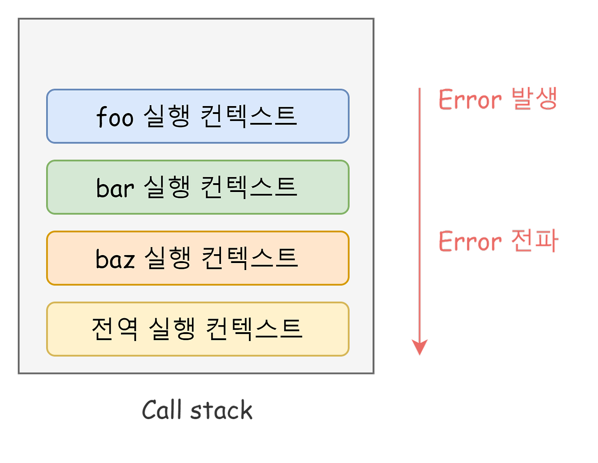

# 12주차 발표 자료

# 46장 제너레이터와 async/await
## 46.1 제너레이터란?

- 코드 블록의 실행을 일시 중지했다가 필요한 시점에 재개할 수 있는 특수 함수

1. 제너레이터 함수는 함수 호출자에게 함수 실행의 제어권을 양도할 수 있다.
2. 제너레이터 함수는 함수 호출자와 함수의 상태를 주고받을 수 있다.
3. 제너레이터 함수를 호출하면 제너레이터 객체를 반환한다.

## 46.2 제너레이터 함수의 정의

```jsx
// 제너레이터 함수 선언문
function* genDecFunc() {
  yield 1;
}

// 제너레이터 함수 표현식
const genExpFunc = function* () {
  yield 1;
}

// 제너레이터 메서드
const obj = {
  * genObjMethod() {
    yield 1;
  }
}

// 제너레이터 클래스 메서드
class MyClass {
  * genClsMethod() {
    yield 1;
  }
}
```

- 제너레이터 함수는 `function*` 키워드로 선언한다
- 하나 이상의 `yield` 표현식을 포함한다
- 화살표 함수로 정의할 수 없다
- 생성자 함수로 호출할 수 없다 (new 안됨)

## 46.3 제너레이터 객체

- 제너레이터 함수는 일반 함수처럼 함수 코드 블록을 실행하는 것이 아니라 제너레이터 객체를 생성해 반환한다

```jsx
function* genFunc() {
  try {
    yield 1;
    yield 2;
    yield 3;
  } catch(e) {
    console.error(e)
  }
}

const generator = genFunc();

console.log(generator.next()) // {value: 1, done: false}
console.log(generator.next()) // {value: 2, done: false}
console.log(generator.next()) // {value: 3, done: false}
console.log(generator.next()) // {value: undefined, done: true}

console.log(generator.return('End!')) // {value: "End!", done: true}

console.log(generator.throw('Error!')) // {value: undefined, done: true}
```

- next 메서드를 호출하면 제너레이터 함수의 yield 표현식까지 코드 블록을 실행하고
  - yield된 값을 value 프로퍼티 값으로
  - false 를 done 프로퍼티 값으로 갖는 iterator result 객체를 반환한다
- return 메서드를 호출하면
  - 인수로 전달받은 값을 value 프로퍼티 값으로
  - true를 done 프로퍼티 값으로 갖는 iterator result 객체를 반환한다
- throw 메서드를 호출하면
  - 인수로 전달받은 에러를 발생시키고
  - undefined를 value 프로퍼티 값으로
  - true를 done 프로퍼티 값으로 갖는 iterator result 객체를 반환한다

## 46.4 제너레이터의 일시 중지와 재개

- yield 키워드를 통해 제너레이터 함수의 실행을 일시 중지시키거나 뒤에 오는 표현식의 평가 결과를 제너레이터 함수 호출자에게 반환한다
- 제너레이터 객체의 next 메서드를 호출하면 yield 표현식까지 실행되고 일시 중지된다.
- 남은 yield 표현식이 없으면, 제너레이터 함수의 마지막까지 실행한다. value는 undefined이다

## 46.6 async/await

- 제너레이터보다 간단하고 가독성 좋게 비동기 처리를 동기 처리처럼 동작하도록 구현하는 방법

## 46.6.1 async 함수

- await 키워드는 반드시 async 함수 내부에서 사용해야 한다
- async 함수는 언제나 프로미스를 반환한다

```jsx
// async 함수 선언문
async function foo (n) { return n; }
foo(1).then(v => console.log(v)) // 1

// async 함수 표현식
const bar = async function (n) { return n; }
bar(2).then(v => console.log(v)) // 2

// async 화살표 함수
const baz = async n => n;
baz(3).then(v => console.log(v)) // 3

// async 메서드
const obj = {
  async foo(n) { return n; }
}
obj.foo(4).then(v => console.log(v)) // 4

// async 클래스 메서드
class MyClass {
  async bar(n) { return n; }
}
const myClass = new MyClass();
myClass.bar(5).then(v => console.log(v)) // 5
```

## 46.6.2 await 키워드

- 프로미스가 settled 상태 (비동기 처리가 수행된 상태)가 될 때까지 대기하다가 settled 상태가 되면 프로미스가 resolve한 처리 결과를 반환한다
- await 키워드는 반드시 프로미스 앞에서 사용해야 한다

```jsx
async function foo() {
  const a = await new Promise(resolve => setTimeout(() => resolve(1), 3000));
  const b = await new Promise(resolve => setTimeout(() => resolve(2), 2000));
  const c = await new Promise(resolve => setTimeout(() => resolve(3), 1000));

  console.log([a, b, c]) // [1, 2, 3]
}

foo()
```

- 첫 번째 프로미스는 settled 상태가 될 때까지 3초, 다음은 2초, 마지막은 1초가 소요된다.

## 46.6.3 에러 처리

- async/await에서 에러 처리는 try...catch 문을 사용할 수 있다
- async 함수 내에서 catch 문을 사용해서 에러 처리를 하지 않으면 async 함수는 발생한 에러를 reject하는 프로미스를 반환한다

```jsx
const fetch = require('node-fetch')

const foo = async () => {
  const wrongUrl = 'https://wrong.url';
  const response = await fetch(wrongUrl);
  const data = await response.json();
  return data;
}

foo().then(console.log).catch(console.error) // TypeError: Failed to fetch
```

- Promise.prototype.catch 후속 처리 메서드를 사용해 에러를 캐치하는 예시

# 47장 에러 처리
## 47.2 try...catch...finally 문

```jsx
try {
  // 실행할 코드
} catch (err) {
  // try 코드 블록에서 에러가 발생하면 이 코드 블록의 코드를 실행
} finally {
  // 에러 발생과 상관없이 반드시 한 번 실행
}
```

## 47.4 throw 문

```jsx
try {
  // 에러 객체를 던지면 catch 코드 블록이 실행되기 시작한다.
  throw new Error('something wrong');
} catch (error) {
  console.log(error); // Error: something wrong
}
```

- 에러를 발생시키려면 try 코드 블록에서 throw 문으로 에러 객체를 던져준다
- 에러를 던지면 catch 문의 에러 변수가 생성되고 던져진 에러 객체가 할당된다
- 그 후 catch 코드 블록이 실행된다

## 47.5 에러의 전파

- 에러는 caller 방향으로 전파됨
- 콜 스택의 아래 방향(Running Execution Context가 push 되기 직전에 push된 실행 컨텍스트 방향) 으로 전파됨
- 비동기 함수는 에러를 전파할 caller가 존재하지 않음

```jsx
const foo = () => {
  throw Error('foo에서 발생한 에러'); // ④
};

const bar = () => {
  foo(); // ③
};

const baz = () => {
  bar(); // ②
};

try {
  baz(); // ①
} catch (err) {
  console.error(err);
}
```
1. baz 함수를 호출하면
2. bar 함수가 호출되고
3. foo함수가 호출되고 foo 함수는
4. 에러를 throw한다. 
    - 이 때 foo 함수가 throw한 에러는 다음과 같이 호출자에게 전파되어 전역에서 캐치된다.

